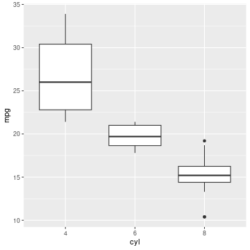

## 1. Outline analysis 1
This document contains examples on how to set up an R script and use `knitr::spin()` to convert it into an Rmd file. <br/>
Note that if you go down this path, you'd need to use a slightly different syntax in your R scripts. Check [here](https://bookdown.org/yihui/rmarkdown-cookbook/spin.html) and [here](https://rpubs.com/alobo/spintutorial) for an overview of the commands. <br/>
I intended to create this template in order to speed up report generation and code development at the same time 
without the need of having to manually copy your R scripts into an Rmd file at the end.
In this way, and by using the set of executable commands (see repo README) you should be able to automatically convert everything all at once <br/>


### First chunk: show some data


```r
library(data.table)
library(ggplot2)
head(mtcars)
```

```
##                    mpg cyl disp  hp drat    wt  qsec vs am gear carb
## Mazda RX4         21.0   6  160 110 3.90 2.620 16.46  0  1    4    4
## Mazda RX4 Wag     21.0   6  160 110 3.90 2.875 17.02  0  1    4    4
## Datsun 710        22.8   4  108  93 3.85 2.320 18.61  1  1    4    1
## Hornet 4 Drive    21.4   6  258 110 3.08 3.215 19.44  1  0    3    1
## Hornet Sportabout 18.7   8  360 175 3.15 3.440 17.02  0  0    3    2
## Valiant           18.1   6  225 105 2.76 3.460 20.22  1  0    3    1
```

### Second chunk: plot data


```r
ggplot(mtcars,aes(x=as.factor(cyl),y=mpg))+ 
    geom_boxplot() + 
    xlab('cyl') + 
    ylab('mpg')
```



