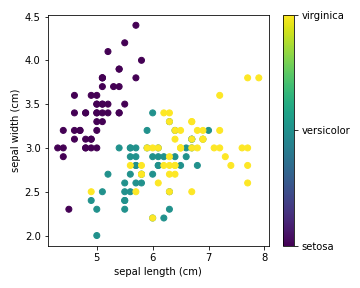

---
title: analysis2
output: 
  md_document:
        toc: true
        number_sections: true
---
## 1. Outline analysis 2
This document contains instead an example on how to set up a python script and the use `knitr::spin()` for converting it into an Rmd file. <br/>
Remember to add the 2 lines below (from the [reticulate package](https://rstudio.github.io/reticulate/index.html)) to each python script to ensure its conversion to Rmd and then md.
NB: you can find which interpreter you are using by running `py_config()`
### First chunk: show some data


```r
knitr::opts_chunk$set(
                eval = TRUE, echo = TRUE, include=TRUE,
                fig.width = 5, fig.height = 5, dev="png",
                # fig.path= path/to/folder/with/all/figs,
                warning=TRUE, error=TRUE)
library(reticulate)
use_python("/stornext/System/data/tools/snakemake/snakemake-7.12.0/bin/python3")
```


```python
import pandas as pd
from sklearn import datasets
import matplotlib.pyplot as plt

iris = datasets.load_iris()
iris_df = pd.DataFrame(data=iris.data, columns=iris.feature_names)
iris_df.head()
```

```
##    sepal length (cm)  sepal width (cm)  petal length (cm)  petal width (cm)
## 0                5.1               3.5                1.4               0.2
## 1                4.9               3.0                1.4               0.2
## 2                4.7               3.2                1.3               0.2
## 3                4.6               3.1                1.5               0.2
## 4                5.0               3.6                1.4               0.2
```

```python
x_index = 0
y_index = 1
```
### Second chunk: plot data


```python
formatter = plt.FuncFormatter(lambda i, *args: iris.target_names[int(i)])

plt.figure(figsize=(5, 4))
plt.scatter(iris.data[:, x_index], iris.data[:, y_index], c=iris.target)
plt.colorbar(ticks=[0, 1, 2], format=formatter)
```

```
## <matplotlib.colorbar.Colorbar object at 0x2b8fe8263910>
```

```python
plt.xlabel(iris.feature_names[x_index])
plt.ylabel(iris.feature_names[y_index])

plt.tight_layout()
plt.show()

```


